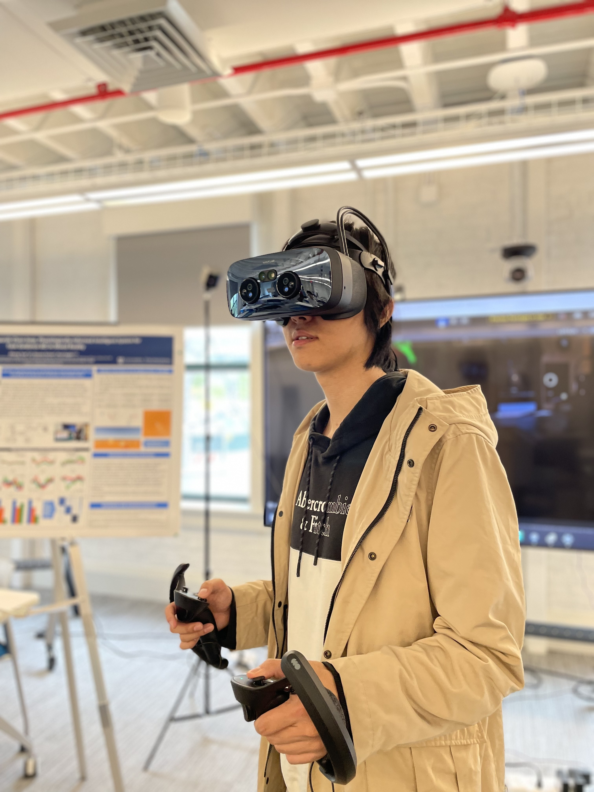
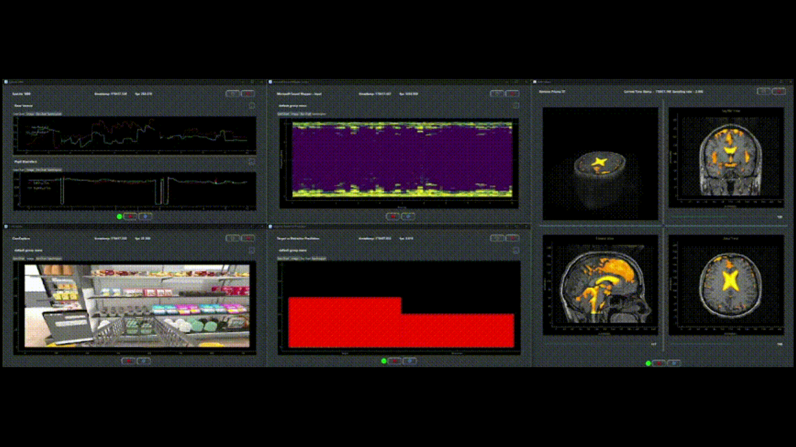
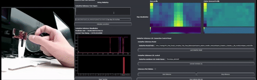

👋 Welcome! I'm a dynamic researcher 🧠, 
inventive game developer 🎮, 
and a passionate pianist 🎹 with an unwavering love for Chopin 🎼.

Checkout my **[projects](https://haowenweijohn.github.io/projects/)**🔬,
**[publications](https://haowenweijohn.github.io/publications/)**📝, and **[music](https://haowenweijohn.github.io/music/)** 🎵.

With a strong foundation in computer science and electrical engineering, 
I specialize in pioneering brain-computer interface (BCI) technology. 
My work focuses on integrating advanced physiological data to create real-time, 
accessible signal processing solutions through machine learning and deep learning techniques. 
Driven by a desire to bridge gaps and create opportunities, I am dedicated to advancing Human-Computer Interaction and biomedical imaging to improve lives and make technology accessible to all.

<u>Research Interests:</u> 
Brain-Computer Interfaces (BCI),
Human-Computer Interaction (HCI),
Virtual Reality (VR),
Augmented Reality (AR),
Eye-Tracking,
Neuroimaging (fMRI, EEG),
Brain Stimulation (TMS, TES),
Signal Processing,
Deep Learning, Machine Learning,
Computer Vision,
Mobile and Ubiquitous Computing.

<u>Other Interests:</u> Piano, Soccer, Chess

[//]: # (## Education)

[//]: # ()
[//]: # (**Columbia University**  )

[//]: # (*Sep 2022 - May 2024*)

[//]: # (- Master of Computer Science &#40;Thesis Track&#41;)

[//]: # (- Thesis Topic: From Brain–Computer Interfaces to AI-Enhanced Diagnostics: Developing Cutting-Edge Tools for Medical and Interactive Technologies)

[//]: # (- Research in Brain-Computer Interfaces and Neuroimaging)

[//]: # (- GPA: 3.81)

[//]: # ()
[//]: # (**Worcester Polytechnic Institute**  )

[//]: # (*Aug 2018 - May 2022*)

[//]: # (- Bachelor Of Computer Science & Electrical and Computer Engineering &#40;Double Major&#41;)

[//]: # (- Mechanical Engineering &#40;Minor&#41;)

[//]: # (- Human-Computer Interaction)

[//]: # (- GPA: 3.91)

## Featured Projects

  <!-- PhysioLabXR Project -->
  

    <a href="https://haowenweijohn.github.io/publication/2024-01-11-PhysioLabXR" style="text-decoration: none; color: inherit;">
      <!-- Image container with fixed height -->
      

        
      

      
<strong>PhysioLabXR: Real-Time Multi-Modal Brain-Computer Interface</strong>

    </a>
  

  <!-- IndexPen Project -->
  

    <a href="https://haowenweijohn.github.io/publication/2022-07-07-IndexPen" style="text-decoration: none; color: inherit;">
      <!-- Image container with fixed height -->
      

        
      

      
<strong>IndexPen: Two-Finger Text Input with Millimeter-Wave Radar</strong>

    </a>
  

## Recent News

- **September 6th**: Began my new position as a **Research Scientist** at the **Martinos Center for Biomedical Imaging**, Harvard Medical School.🏢
- **September 5th**: Submitted a paper as a part of my Master's thesis to **CHI 2025**.📝
- **May 13th**: Graduated from Columbia University with a Master of Science in Computer Science (Thesis Track).🎓
- **May 1st**: Successfully defended my Master’s thesis,
*From Brain-Computer Interfaces to AI-Enhanced Diagnostics: Developing Cutting-Edge Tools for Medical and Interactive Technologies*
([Paper](https://mice.cs.columbia.edu/getTechreport.php?techreportID=1673&format=pdf&))📝,
under the supervision of 
[Steven K. Feiner](https://www.engineering.columbia.edu/faculty/steven-feiner),
[Paul Sajda](https://www.bme.columbia.edu/faculty/paul-sajda),
[Kaveri Thakoor](https://www.vagelos.columbia.edu/profile/kaveri-thakoor-phd), at Columbia University.🥳

## Publications

Please refer to [Publications Page](https://haowenweijohn.github.io/publications/)
for more details about each paper.

**\* These Authors Contributed Equally.**

- Ziheng Li\*, **_Haowen Wei_**\*, Ziwen Xie, Yunxiang Peng, June Pyo Suh, Steven Feiner, Paul Sajda. "PhysioLabXR: A software platform for real-time multi-modal, brain-computer interfaces and extended reality experiments." *Journal of Open Source Software*, Sep 2023. [Paper](https://joss.theoj.org/papers/10.21105/joss.05854), [GitHub](https://github.com/PhysioLabXR/PhysioLabXR)
- **_Wei, Haowen_**\*, Ziheng Li\*, Alexander D. Galvan, Zhuoran Su, Xiao Zhang, Kaveh Pahlavan, and Erin T. Solovey. "IndexPen: Two-Finger Text Input with Millimeter-Wave Radar." *Proceedings of the ACM on Interactive, Mobile, Wearable and Ubiquitous Technologies* 6, no. 2 (2022): 1-39. [Paper](https://dl.acm.org/doi/10.1145/3534601)
- Xie, Xing, **_Haowen Wei_**, and Yongjie Yang. "Real-Time LiDAR Point-Cloud Moving Object Segmentation for Autonomous Driving." *Sensors* 23, no. 1 (2023): 547. [Paper](https://www.mdpi.com/1424-8220/23/1/547)
- Su, Zhuoran, Kaveh Pahlavan, Emmanuel Agu, and **_Haowen Wei_**. "Proximity Detection During Epidemics: Direct UWB TOA Versus Machine Learning Based RSSI." *International Journal of Wireless Information Networks* 29, no. 4 (2022): 480-490. [Paper](https://link.springer.com/article/10.1007/s10776-022-00577-4)
- Cheng, Shiyu, Kaveh Pahlavan, **_Haowen Wei_**, Zhuoran Su, Seyed Reza Zekavat, and Ali Abedi. "A Study of Interference Analysis Between mmWave Radars and IEEE 802.11 AD at 60 GHz Bands." *International Journal of Wireless Information Networks* 29, no. 3 (2022): 222-231. [Paper](https://link.springer.com/article/10.1007/s10776-022-00564-9)

### Under Review

- Ziheng Li\*, **_Haowen Wei_**\*, Kuang Sun, David Li, Steven Feiner, Kaveri Thakoor. "Interactively Assisting Glaucoma Diagnosis with an Expert Knowledge-distilled Vision Transformer." (Under Review at CHI 2025)  

- **_Haowen Wei_**\*, Ziheng Li\*, Xichen He, Ben Yang, Steven Feiner. "Efficient Text-Entry in Mixed Reality: Tap, Gaze & Pinch, SwEYEpe." (CHI 2025 Late-Breaking Work)  

## Conference Presentations

- **2023 Brain & Human Body Modeling (BHBM)** - Athinoula A. Martinos Center for Biomedical Imaging (Hybrid Local Conference): "PhysioLabXR: A software platform in Python for multi-modal brain-computer interface and real-time experiment pipelines." **Haowen Wei**, Ziheng Li, Steven Feiner, Paul Sajda [Link](https://tmslab.martinos.org/conferences/brain-and-human-body-modeling-conference-2023-online-format-with-limited-in-person-participation/)
- **2022 Brain & Human Body Modeling (BHBM)** - Athinoula A. Martinos Center for Biomedical Imaging (Hybrid Local Conference): "Hardware, real-time signal processing techniques, and data collection for TMS induced EMG responses with RenaLabApp." **Haowen Wei**, Mohammad Daneshzand [Link](https://tmslab.martinos.org/conferences/brain-and-human-body-modeling-conference-2022/)
- **2021 Brain & Human Body Modeling (BHBM)** - Athinoula A. Martinos Center for Biomedical Imaging (Hybrid Local Conference): "Interplay between TES and EEG Interplay with boundary element fast multipole method (BEM-FMM) via Helmholtz reciprocity principle." Sergey Makarov, **Haowen Wei**, Aapo Nummenmaa [Link](https://tmslab.martinos.org/conference/)

