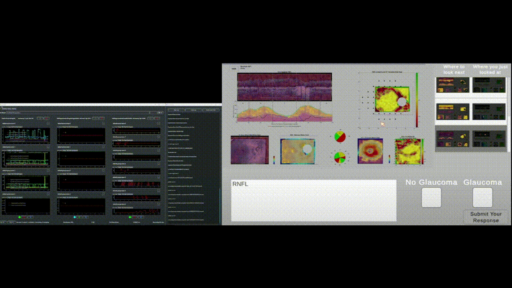
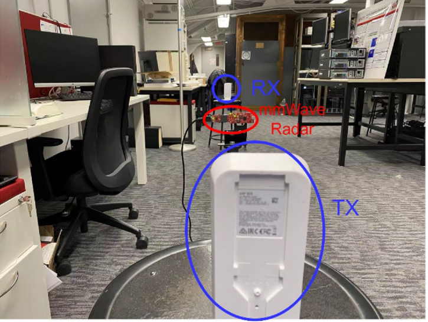

  

    
    
<strong>PhysioLabXR: Real-Time Multi-Modal Brain-Computer Interface</strong>

  

  

    
    
<strong>Glaucoma Diagnosis with Expert Knowledge-Distilled Vision Transformer</strong>

  

  

    
    
<strong>Efficient Text-Entry in Mixed Reality: Tap, Gaze & Pinch, SwEYEpe</strong>

  

  

    
    
<strong>IndexPen: Two-Finger Text Input with Millimeter-Wave Radar</strong>

  

  

    
    
<strong>Real-Time LiDAR Point-Cloud Moving Object Segmentation</strong>

  

  

    
    
<strong>Proximity Detection During Epidemics: UWB TOA vs. ML-Based RSSI</strong>

  

  

    
    
<strong>Interference Analysis Between mmWave Radars and IEEE 802.11 AD</strong>

  

