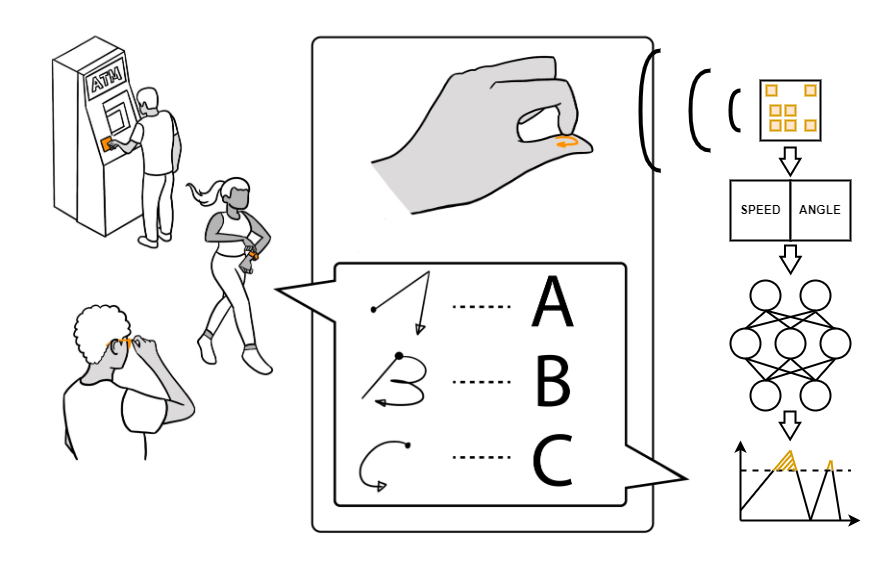

**Duration:** August 2019 – September 2022  
**Role:** Project Lead, Lead Software Engineer, First Author  
**Advisor:** [Dr. Erin Solovey](https://users.wpi.edu/~esolovey/index.html)   &  [Dr. Kaveh Pahlavan](https://en.wikipedia.org/wiki/Kaveh_Pahlavan)

## Overview

**IndexPen** is a novel interaction technique for **touch-free text input** using two-finger in-air **micro-gestures**. Our system leverages **millimeter-wave radar sensing** without user instrumentation. IndexPen can recognize **30 distinct gestures**, including **A-Z, Space, Backspace, Enter**, and a special **Activation gesture**. A **noise class** differentiates between gestures and non-gestural noise. The system achieved **95.89% accuracy** across **31 classes** in a 10-day study with five participants. In a separate study, **16 first-time users** improved their performance over **five sessions** using **transfer learning**, reaching an **88.3% F-1 score** and **86.2% sentence accuracy**. This work demonstrates the potential for **future gesture-based text input interfaces**.

As part of my undergraduate project at Worcester Polytechnic Institute (WPI), I led and built **IndexPen** from scratch, creating a novel touch-free text input system using **millimeter-wave radar** to detect **two-finger in-air micro-gestures**. The system mirrors natural handwriting, enabling users to input the English alphabet without physical contact, making it ideal for hands-free and sterile environments.

## Key Contributions
- **Leadership**: Spearheaded the project from concept to completion, managing data collection, machine learning model development, and signal processing.
- **Deep Learning**: Designed and implemented a **CNN + LSTM** model for gesture recognition using radar data.
- **User Study**: Conducted user studies with **30 participants**, demonstrating high accuracy and usability.

## Novelty
- Developed a new **touch-free text input** system using radar and deep learning, offering an innovative solution for **gesture-based Human-Computer Interaction**.

## Awards & Achievements
- **Second Best Undergraduate Major Qualifying Project** at **Worcester Polytechnic Institute**.

**Supplementary Video:**

