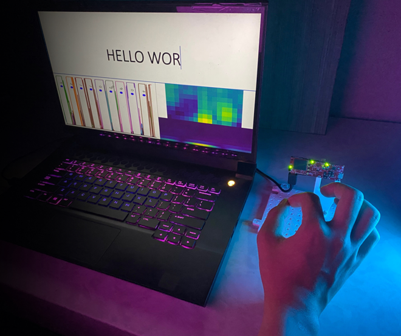

  

    
  

  

    
  

[//]: # (![TeaserImage]&#40;../images/publications/2022-07-07-IndexPen-Teaser.png&#41;)

**Duration:** August 2019 – September 2022  
**Role:** Project Lead, Lead Software Engineer, First Author  
**Advisor:** [Dr. Erin Solovey](https://users.wpi.edu/~esolovey/index.html)   &  [Dr. Kaveh Pahlavan](https://en.wikipedia.org/wiki/Kaveh_Pahlavan)

  
  
<strong>I was writing "Hello World"</strong>

## Overview
**IndexPen** is a touch-free text input system that uses **millimeter-wave radar** to detect two-finger in-air micro-gestures. This system, developed as part of my undergraduate project at WPI, can recognize **30 distinct gestures** (A-Z, Space, Backspace, Enter) plus a noise differentiation class. Achieving **95.89% accuracy** in a 10-day study and **88.3% F-1 score** for first-time users through transfer learning, IndexPen demonstrates the potential for intuitive, hands-free text input in various environments.

## My Contributions
- **Leadership:** Led the project from concept to implementation, overseeing data collection, model development, and signal processing.
- **Deep Learning:** Designed and implemented a **CNN + LSTM** model for radar-based gesture recognition.
- **User Study:** Conducted studies with **30 participants** to validate system accuracy and usability.

## Key Features
- **Touch-Free Input:** Uses radar to detect in-air gestures, providing a hands-free method of text input.
- **Natural Gesture Recognition:** Recognizes **30 gestures**, allowing users to write the English alphabet naturally without physical contact.
- **High Accuracy:** Achieved **95.89% accuracy** across **31 classes** and **86.2% sentence accuracy** in user studies.

## Novelty
- Introduced a novel approach to **gesture-based Human-Computer Interaction**, enabling intuitive text input in sterile or hands-free scenarios through radar and deep learning.

## Awards & Achievements
- **2022 Best Undergraduate Major Qualifying Project at Worcester Polytechnic Institute, 3rd Place.**.

---

**Supplementary Video:**

