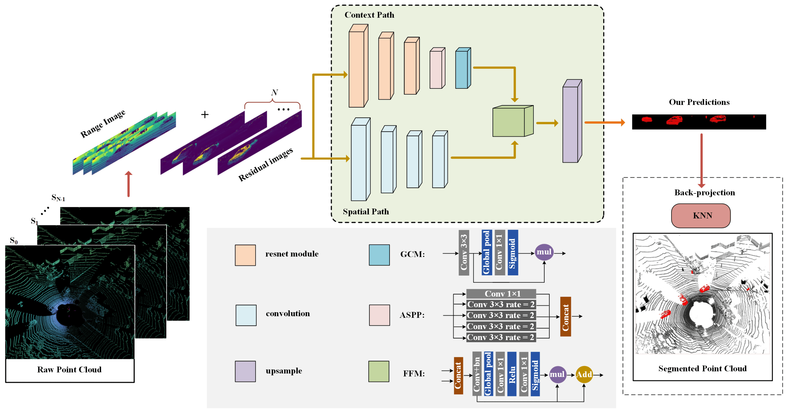

**Duration:** March 2021 – September 2022  
**Role:** Lead Software Engineer

## Overview
I served as the Lead Software Engineer for the **Real-Time LiDAR Point-Cloud Moving Object Segmentation** project, where we developed a **lightweight convolutional neural network (CNN)** for segmenting moving and non-moving objects in LiDAR point clouds for autonomous driving. The network efficiently processes large point clouds in real time on both **GPU** and **FPGA** platforms, achieving high-speed performance while significantly reducing computational complexity.

## Key Contributions
- **Network Design**: Built a deep neural network to segment LiDAR point clouds into moving and static objects using **CNN architecture** with **66% fewer parameters** than the state-of-the-art.
- **Optimization**: Implemented the system to run on both **NVIDIA RTX 3090 GPU** and **FPGA** platforms, achieving real-time performance with **32 fps**.
- **Benchmark**: Evaluated the model’s accuracy with the **SemanticKITTI dataset**, achieving an **IoU score of 51.3%** for moving object segmentation.

## Novelty
- Developed a **lightweight CNN** that enables **real-time moving-object segmentation** on both GPU and FPGA, reducing computational overhead for embedded autonomous driving applications.

## Awards & Publications
- Published in **Sensors 23, no. 1 (2023): 547**.  
  [Link to Publication](https://www.mdpi.com/1424-8220/23/1/547)

---
