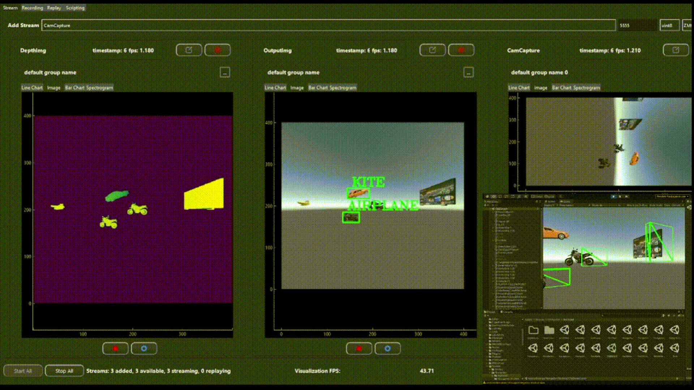

**Duration:** May 2020 – Present  
**Role:** Co-Founder, Lead Software Engineer, Co-First Author  
**Advisor:** [Dr. Steven K. Feiner](https://www.engineering.columbia.edu/faculty/steven-feiner) & [Dr. Paul Sajda](https://www.bme.columbia.edu/faculty/paul-sajda)

### Use Cases   

  

    
    
*EEG + fMRI + Eye-Tracking + Audio*

  

  

    
    
*Camera + Object Detecction*

  

  

    
    
*VR in Unity + Object Detection*

  

  

    
    
*EEG + Eye Tracking + VR in Unity*

  

## Overview
PhysioLabXR is an open-source Python platform designed for real-time **multi-modal brain-computer interfaces (BCI)** and **extended reality (XR)** experiments. It integrates data from EEG, EMG, fNIRS, and eye trackers to process and visualize physiological data in real-time, making it a versatile tool for neuroscience and human-computer interaction (HCI) research. The platform has been adopted by research labs at Columbia University, Harvard Medical School, and other leading institutions.

## Origin Story
PhysioLabXR began as a solution to challenges I faced during my sophomore year at Worcester Polytechnic Institute (WPI) while working on real-time data synchronization and visualization in 
sensor fusion experiments. Co-founded with my friend Ziheng 'Leo' Li, we aimed to create a tool that would streamline experimental pipelines for researchers. Over four years of continuous development and collaboration, PhysioLabXR has evolved into a widely used platform in top research labs.

### My Contributions
- **Leadership:** Spearheaded the development of core features like data visualization, device interfaces, and signal processing.
- **Sensor Fusion:** Implemented Lab Streaming Layer (LSL) integration to handle diverse sensor data.
- **User Education:** Created demonstration paradigms like the P300 Speller, aiding researchers in adopting PhysioLabXR.
- **Experiment Pipeline:** Enabled real-time neural network inference with customizable DSP modules.

### Key Features
- **Real-Time Multi-Stream Data Processing:** Visualize and process large datasets from multiple sensors concurrently.
- **Sensor Integration:** Supports EEG, EMG, fNIRS, eye trackers, and more via LSL and serial connections.
- **User-Friendly Interface:** Designed with an intuitive GUI for easy experiment setup and data analysis.
- **Customizable Pipelines:** Offers Python-based scripting for creating custom data processing pipelines.

### Novelty
PhysioLabXR's unique ability to handle real-time multi-modal data sets it apart as a pioneering tool in neurotechnology and extended reality. By providing an open-source, flexible platform, it empowers researchers to explore innovative BCIs and HCI applications efficiently.

### Publications (paper that are under review or in preparation is not included):
PhysioLabXR has been used in several research papers:
- Wei, Haowen, Ziheng Li, Alexander D. Galvan, Zhuoran Su, Xiao Zhang, Kaveh Pahlavan, and Erin T. Solovey. "IndexPen: Two-Finger Text Input with Millimeter-Wave Radar." Proceedings of the ACM on Interactive, Mobile, Wearable, and Ubiquitous Technologies 6, no. 2 (2022): 1-39.
- Koorathota, Sharath Chandra. "Multimodal deep learning systems for analysis of human behavior, preference, and state." PhD diss., Columbia University, 2023.
- Lapborisuth, Pawan, Sharath Koorathota, and Paul Sajda. "Pupil-linked arousal modulates network-level EEG signatures of attention reorienting during immersive multitasking." Journal of Neural Engineering 20, no. 4 (2023): 046043.

---

* For more information, please check out the [PhysioLabXR GitHub repository](https://github.com/PhysioLabXR/PhysioLabXR-Community) and [Documentation](https://physiolabxrdocs.readthedocs.io/en/latest/).

---

**Supplementary Video:**

